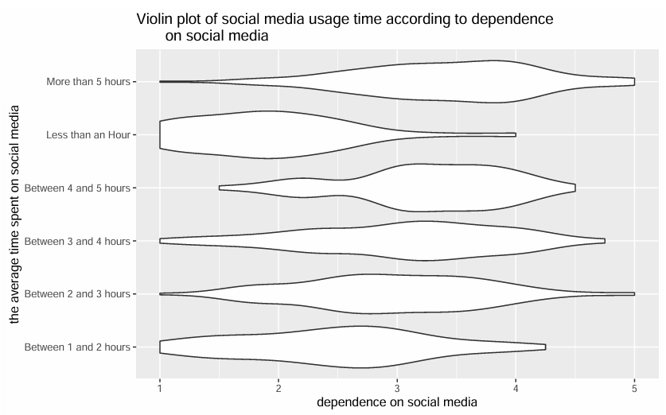
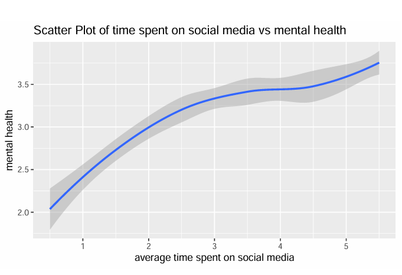
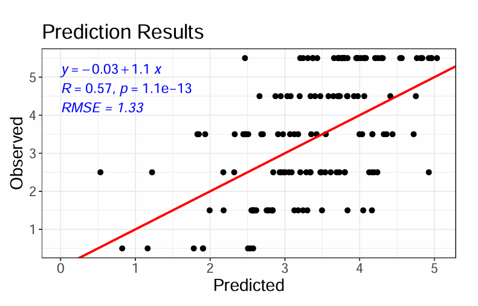

# Social Media & Mental Health

This project investigates the relationship between time spent on social media and mental health outcomes using survey data from 481 individuals. As social media becomes increasingly integrated into daily life, concerns are growing regarding its effects on emotional well-being, attention, and self-perception. This analysis provides a data-driven perspective on these issues.

## My Contributions

- Responsible for data preprocessing and visual analysis of relationships between social media usage and mental health indicators  
- Contributed to regression modeling and interpreting results to draw insights

## Dataset
The dataset was originally published on Kaggle and includes responses from participants across various age groups and gender identities. It contains 21 variables, including:
- Demographic information (age, gender)
- Average time spent on social media (categorical)
- Responses to questions measuring:
  - Social media dependence
  - Distraction caused by social media
  - Mental health symptoms
  - Social comparison behavior

## Data Cleaning & Feature Engineering
- Removed irrelevant or ambiguous columns
- Converted social media usage time from categorical to numeric (e.g., "2–3 hours" → 2.5)
- Grouped gender into three categories: "Male", "Female", and "Other"
- Created composite variables by averaging related Likert-scale responses:
  - `dependence`: degree of reliance on social media
  - `distraction`: level of interference with daily tasks
  - `mental_health`: level of negative mental health symptoms

## Statistical Analysis

### 1. Exploratory Data Visualization
- Histograms of age, gender distribution, and usage time
- Box and violin plots to show associations between usage time and distraction or dependence
- Trend lines to display changes in mental health indicators across usage groups

### 2. Correlation and Regression
- Positive correlations found between usage time and both distraction and dependence
- Linear regression model using predictors such as age, distraction, comparison, and dependence
- Model performance: Adjusted R² = **0.33**, RMSE = **1.27**

### 3. Hypothesis Testing
- Permutation test indicated a statistically significant difference in mental health scores between high and low usage groups (p < 0.05)
- Bootstrap analysis for Cohen's d yielded an effect size of **0.89**, reflecting a strong relationship

## Key Findings
- High social media usage is associated with:
  - Increased distraction in daily life
  - Greater dependence on social media
  - More frequent self-comparison to others
  - Poorer mental health outcomes
- Evidence supports rejecting the null hypothesis of independence between usage and mental health

## Key Visualizations

1. Violin plot showing the distribution of social media dependence scores across different usage time groups.

2. Trend line displaying how average mental health scores vary with social media usage.

3. Linear regression results comparing actual vs. predicted mental health scores.

## Tools Used
- Language: R
- Packages: `dplyr`, `ggplot2`, `rstatix`, `modelr`
